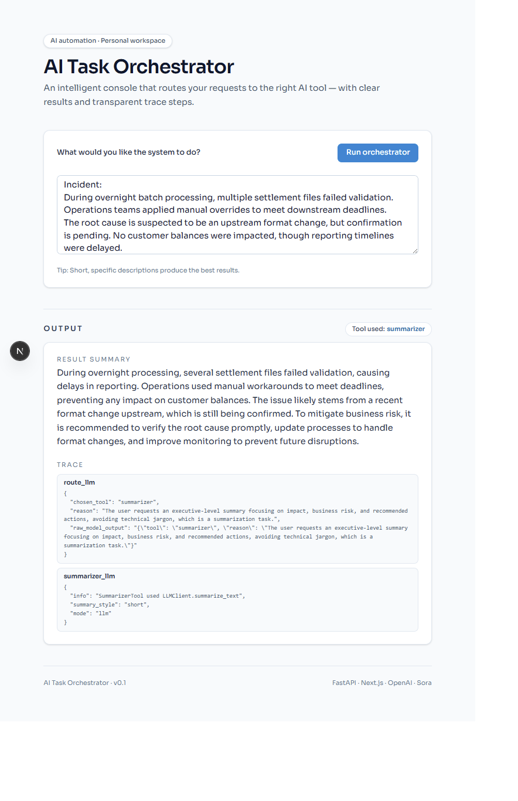
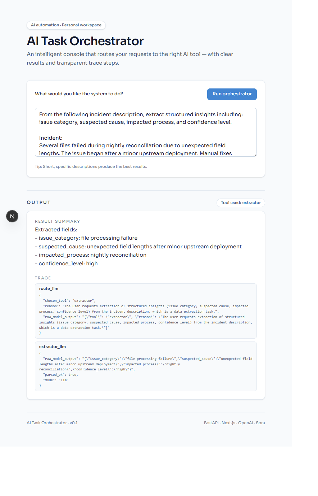
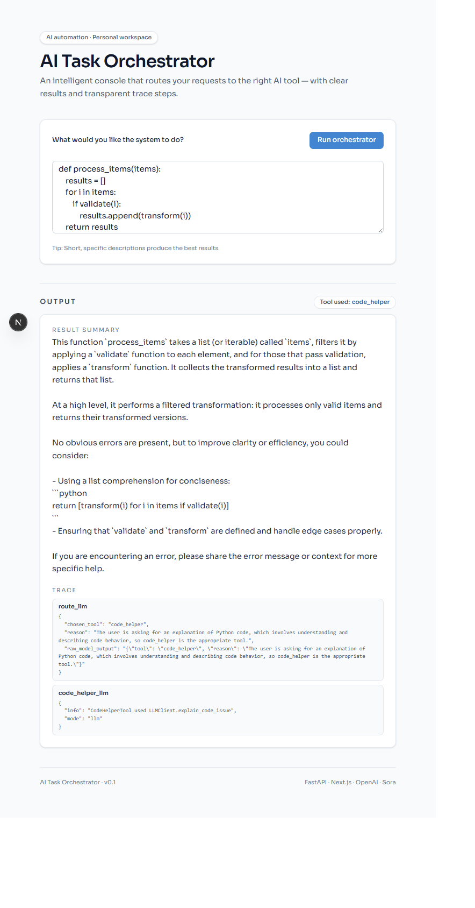

# AI Task Orchestrator — MVP

**AI Task Orchestrator** is a documentation-only MVP that demonstrates how an AI-driven system can route a single natural-language request to the most appropriate AI tool, while producing a clear **Result Summary** and a transparent **Trace**.

> ⚠️ This public repository does **not** contain source code.  
> The implementation is maintained in a private repository.  
> Demos and walkthroughs are available on request.

---

## What this MVP demonstrates

The MVP shows how an AI system can:

1. Accept a single instruction from the user
2. Reason about intent
3. Select the best tool for the task
4. Produce a concise result
5. Provide a **Trace** showing *why* the tool was chosen and how the output was formed

**Traceability is a first-class design principle** in this MVP.

---

## Tools demonstrated

The orchestrator routes requests across three tools:

### Summarize
Decision-oriented summarization, such as:
- Executive incident briefings
- Governance / audit summaries
- Separating confirmed facts, assumptions, and unknowns

### Extractor
Structured extraction from unstructured text, such as:
- Incident decomposition (issue, cause hypothesis, impact, confidence)
- Risk and ownership mapping
- Functional vs non-functional requirement extraction

### Code Helper
Engineering reasoning support (not “code generation”), such as:
- High-level code understanding for reviewers and architects
- Maintainability guidance without rewriting code
- Architecture evolution reasoning (MVP → future product direction)

---

## Transparency by design: Result + Trace

Each run produces:

- **Result Summary** — the user-facing outcome  
- **Trace** — a structured record that shows:
  - routing decision
  - tool selection rationale
  - execution path
  - current limitations / scope boundaries

This is designed to support explainability and future enterprise readiness.

---

## Screenshots

A few representative examples from the MVP UI (all scenarios are fictional and sanitized):

### Summarize (executive incident briefing)

### Extractor (incident decomposition)

### Code Helper (code understanding for reviewers)

More examples are documented in:
- `docs/use-cases.md`

---

## What this MVP is (and is not)

### It is
- A conceptual and functional MVP
- A demonstration of AI task orchestration patterns
- A foundation for domain-specific automation discussions
- A portfolio-grade project focused on clarity, traceability, and intent

### It is not
- A production-ready platform
- A domain-specific solution (e.g., banking, QA, compliance)
- A full workflow automation engine
- A real enterprise data integration / RAG setup (yet)

These boundaries are intentional and reflected in outputs and traces.

---

## Demo & collaboration

This repository is documentation-only.

- Demos and walkthroughs are available **on request**
- Collaboration discussions can be initiated via **GitHub Discussions**

See: `COLLABORATION.md`

---

## Status

- Current state: MVP / concept
- Focus: routing, reasoning, and traceability
- Direction: domain-specific orchestration and automation (future iterations)

---

## License

Shared for educational and illustrative purposes.  
Implementation code remains private.
