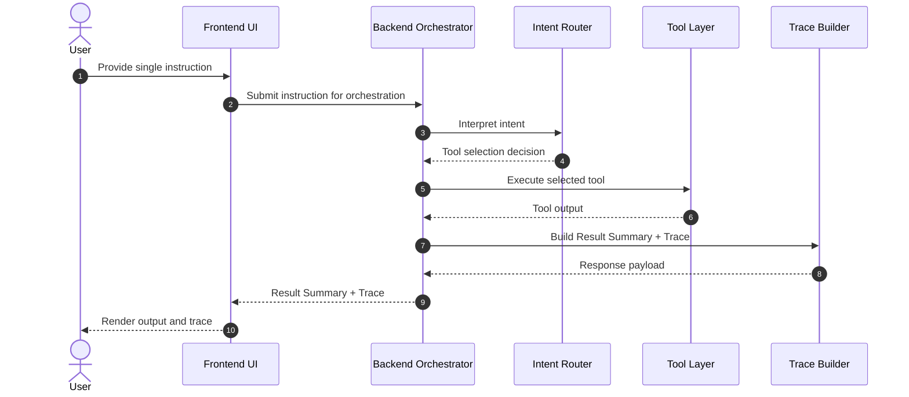

# Sequence Diagram (MVP)

This sequence diagram illustrates the **conceptual runtime flow** of the
AI Task Orchestrator MVP for a single user instruction.

The diagram focuses on **intent routing, tool execution, and trace generation**,
not on implementation details.

Notes:

- The MVP executes a single primary tool per orchestration run.
- Multi-step workflows, external context providers, and domain-specific logic are intentional future extensions and not part of the current scope.