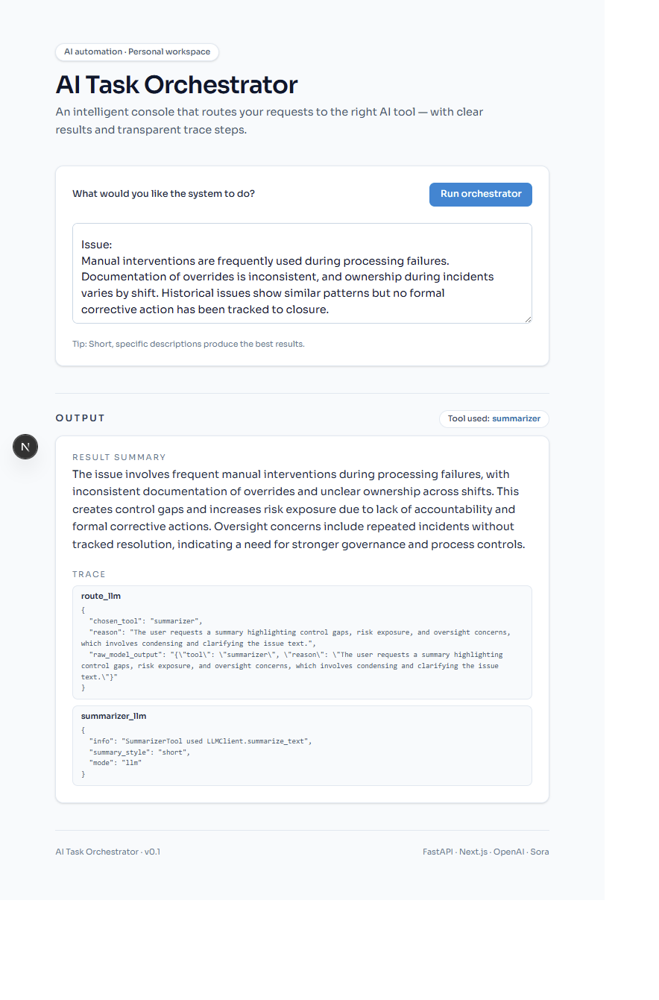
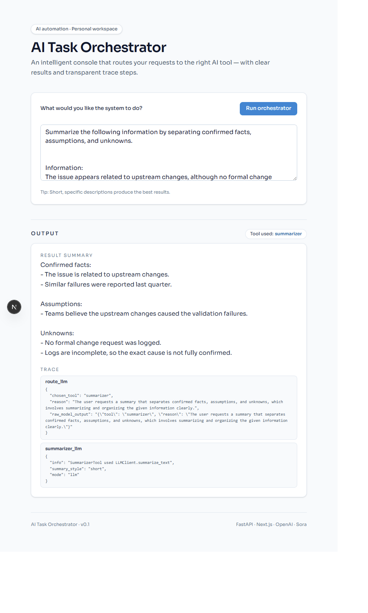
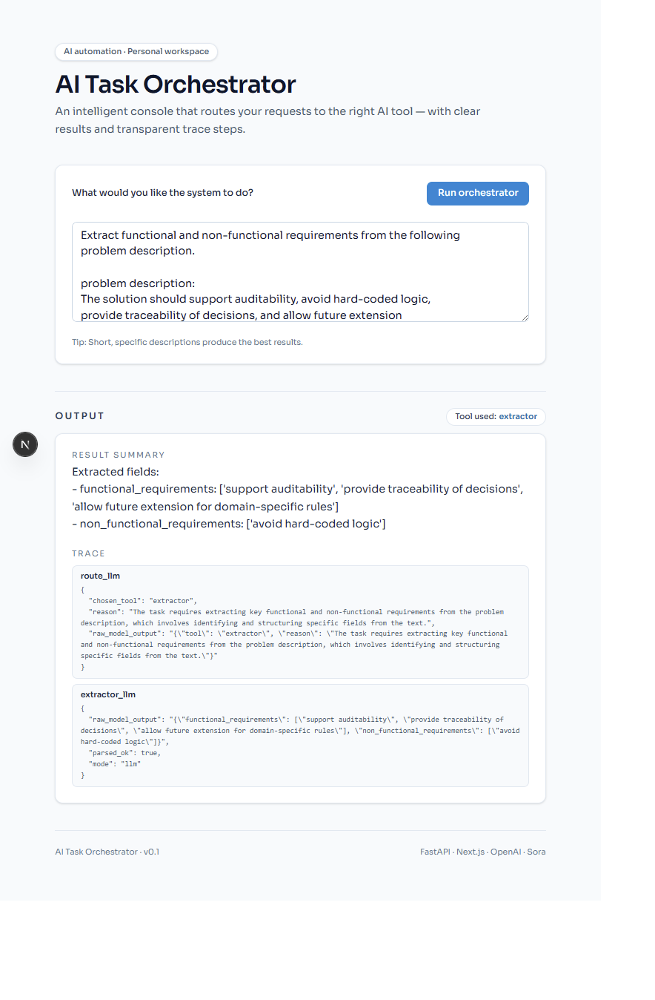
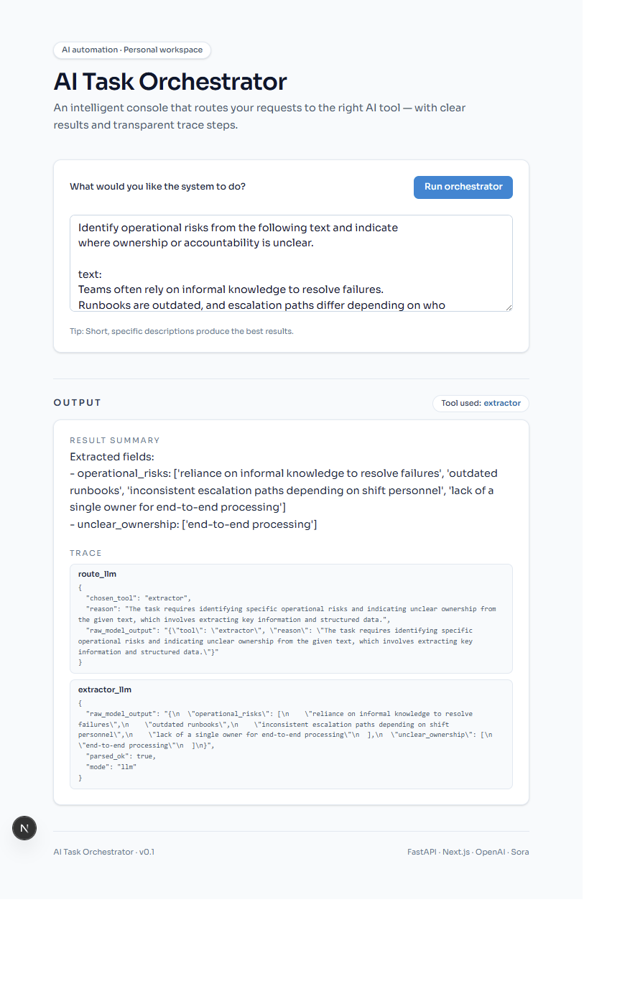
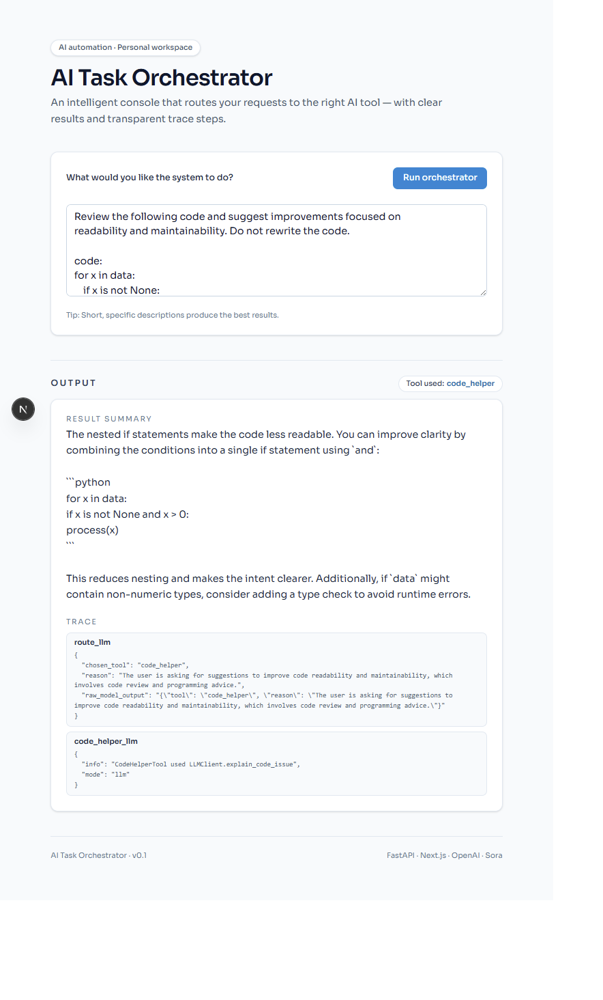
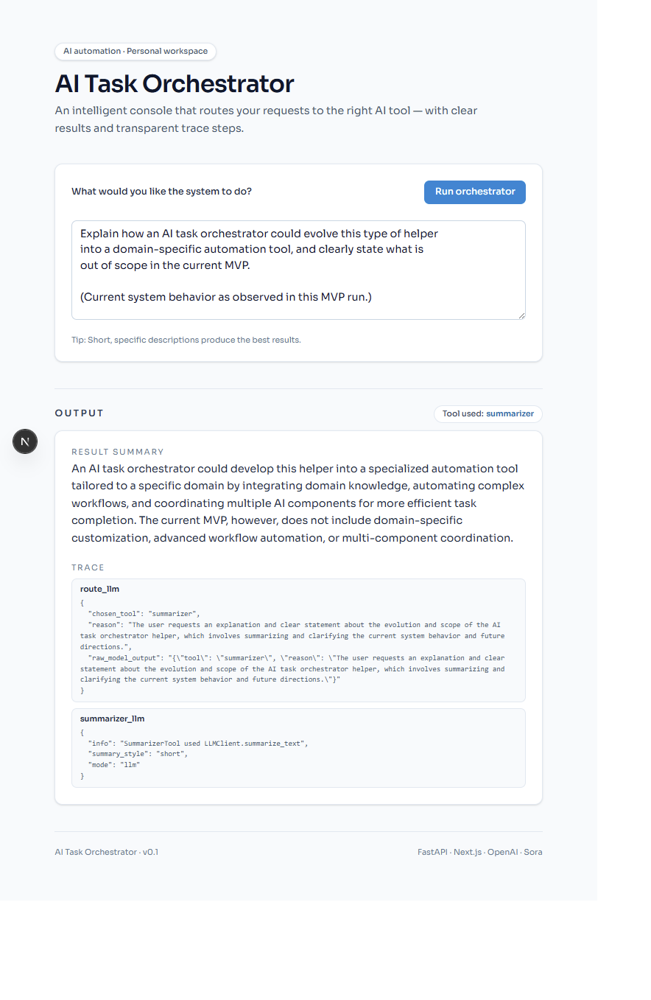

# Use Cases (MVP)

This page documents the MVP use cases shown in the UI screenshots.

**Notes**
- All scenarios are **fictional and sanitized**.
- Each run uses a **single instruction** in the UI input box.
- Outputs are presented as **Result Summary** + **Trace** (tool routing + rationale).

---

## Summarize

### 1) Executive Incident Briefing (Ops → Leadership)

**Prompt**
> Create an executive-level summary of the following operational incident. Focus on impact, business risk, and recommended next actions. Avoid technical jargon.

**Example text used**
> During overnight batch processing, multiple settlement files failed validation. Operations teams applied manual overrides to meet downstream deadlines. The root cause is suspected to be an upstream format change, but confirmation is pending. No customer balances were impacted, though reporting timelines were delayed.

**Complex problem it solves**
- Converts operational complexity into leadership-ready decision context (impact, risk, actions), without losing critical meaning.


---

### 2) Governance / Audit Committee Summary

**Prompt**
> Summarize the following issue for a governance or audit committee. Highlight control gaps, risk exposure, and oversight concerns.

**Example text used**
> Manual interventions are frequently used during processing failures. Documentation of overrides is inconsistent, and ownership during incidents varies by shift. Historical issues show similar patterns but no formal corrective action has been tracked to closure.

**Complex problem it solves**
- Reframes informal operational narratives into governance language (controls, risk, oversight), suitable for audit/risk stakeholders.



---

### 3) Signal vs Noise Separation (Facts / Assumptions / Unknowns)

**Prompt**
> Summarize the following information by separating confirmed facts, assumptions, and unknowns.

**Example text used**
> The issue appears related to upstream changes, although no formal change request was logged. Teams believe this caused the validation failures, but logs are incomplete. Similar failures were reported last quarter.

**Complex problem it solves**
- Forces disciplined incident thinking by explicitly separating what is known from what is guessed and what needs verification.



---

## Extractor

### 4) Incident Decomposition (Ops Triage)

**Prompt**
> From the following incident description, extract structured insights including: issue category, suspected cause, impacted process, and confidence level.

**Example text used**
> Several files failed during nightly reconciliation due to unexpected field lengths. The issue began after a minor upstream deployment. Manual fixes allowed processing to complete before business hours.

**Complex problem it solves**
- Converts unstructured incident notes into structured fields that can support triage, routing, escalation, and reporting.


---

### 5) Requirements Extraction (Business → Tech)

**Prompt**
> Extract functional and non-functional requirements from the following problem description.

**Example text used**
> The solution should support auditability, avoid hard-coded logic, provide traceability of decisions, and allow future extension for domain-specific rules.

**Complex problem it solves**
- Translates ambiguous business language into implementation-ready requirement categories, reducing misalignment across teams.



---

### 6) Risk & Ownership Mapping

**Prompt**
> Identify operational risks from the following text and indicate where ownership or accountability is unclear.

**Example text used**
> Teams often rely on informal knowledge to resolve failures. Runbooks are outdated, and escalation paths differ depending on who is on shift. There is no single owner for end-to-end processing.

**Complex problem it solves**
- Surfaces governance gaps embedded in narrative text: operational risk themes and accountability ambiguity.



---

## Code Helper

### 7) Code Understanding for Reviewers

**Prompt**
> Explain what the following Python code does at a high level, as if for a code reviewer or architect.

**Example text used**
```python
def process_items(items):
    results = []
    for i in items:
        if validate(i):
            results.append(transform(i))
    return results
```

**Complex problem it solves**
 - Accelerates code comprehension for review and governance contexts by summarizing intent and behavior clearly.


---

### 8) Refactor Guidance Without Rewriting

**Prompt**
> Review the following code and suggest improvements focused on readability and maintainability. Do not rewrite the code.

**Example text used**
```python
for x in data:
    if x is not None:
        if x > 0:
            process(x)
```

**Complex problem it solves**
 - Provides actionable maintainability guidance under realistic constraints (no refactor mandate, minimal change appetite).

 

 ---

 ### 9) Architecture Evolution Reasoning (MVP → Product)

**Prompt**
> Explain how an AI task orchestrator could evolve this type of helper into a domain-specific automation tool, and clearly state what is out of scope in the current MVP.

**Example text used**
> (Observed MVP behavior from this run; no external systems or domain data.)

**Complex problem it solves**
- Frames credible expansion paths while explicitly preserving MVP boundaries—useful for architecture and product discussions.

